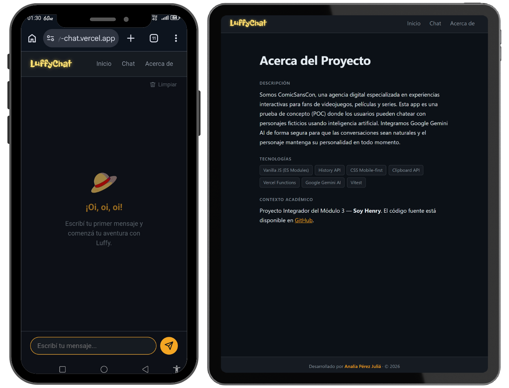

# 🏴‍☠️ LuffyChat

🔗 **[Ver app en producción](https://luffy-chat.vercel.app/)**

Prueba de concepto (POC) desarrollada para **ComicSansCon**, agencia digital especializada en experiencias interactivas para fans de videojuegos, películas y series.

**LuffyChat** es una SPA de chat responsive que permite mantener conversaciones naturales con **Monkey D. Luffy** de One Piece, usando Google Gemini AI como motor de respuestas. La API key nunca se expone al cliente gracias a una Vercel Serverless Function que actúa como proxy seguro.

---

## 🧩 El personaje: Monkey D. Luffy

Monkey D. Luffy es el protagonista del manga/anime **One Piece** creado por Eiichiro Oda. Es el Capitán de la Banda del Sombrero de Paja y su sueño es convertirse en el **Rey de los Piratas** encontrando el legendario tesoro One Piece.

Comió la **Fruta Gomu Gomu** (una Fruta del Diablo), lo que convirtió su cuerpo en goma y le permite estirarse a voluntad. Su personalidad es simple, directa y extremadamente optimista: nunca se rinde, no entiende el sarcasmo y valora a sus amigos por encima de todo.

Su tripulación, la **Banda del Sombrero de Paja**, incluye a Zoro, Nami, Usopp, Sanji, Chopper, Robin... ¡y no te quiero spoilear más!

---

## 📸 Capturas de pantalla en diferentes dispositivos

<div align="center">
 
</div>

---

## ✨ Funcionalidades

### Principales

| Funcionalidad             | Descripción                                                                                                                                                                                            |
| ------------------------- | ------------------------------------------------------------------------------------------------------------------------------------------------------------------------------------------------------ |
| 🔀 SPA con History API    | Navegación interna sin recarga de página                                                                                                                                                               |
| 🗺️ Rutas internas         | `/home`, `/chat`, `/about` y página 404 personalizada                                                                                                                                                  |
| 💬 Funcionalidad del Chat | Diferenciación visual usuario/personaje, scroll automático al último mensaje, historial durante la sesión e indicador "Luffy está escribiendo..."                                                      |
| 🤖 Gemini AI              | Respuestas generadas por Google Gemini AI                                                                                                                                                              |
| 🔐 Proxy seguro           | Serverless Function en Vercel — la API key nunca llega al cliente                                                                                                                                      |
| 📱 Responsive             | Diseño mobile-first (320px → 768px → 1024px)                                                                                                                                                           |
| 🎨 Identidad visual       | Tema oscuro coherente con la estética del personaje                                                                                                                                                    |
| ✅ Validación de datos    | Doble validación antes de llegar a Gemini: el frontend descarta mensajes vacíos o solo espacios, y la Serverless Function verifica que el array de mensajes exista y no esté vacío (HTTP 400 si falla) |
| 🧪 Tests unitarios        | 12 tests con Vitest cubriendo funciones puras e integración con fetch mockeado                                                                                                                         |

### Extras

| Extra                      | Descripción                                                                                                                                   |
| -------------------------- | --------------------------------------------------------------------------------------------------------------------------------------------- |
| 🖼️ Empty state             | Pantalla de bienvenida que guía al usuario a iniciar la conversación                                                                          |
| 🕐 Timestamps              | Cada burbuja muestra fecha y hora con `toLocaleString`                                                                                        |
| 📋 Botón de copiar         | Copia cualquier mensaje con feedback visual (ícono de check por 1.5s)                                                                         |
| ✖️ Limpiar mensaje         | El input es de tipo `search`, lo que hace que el browser muestre una X nativa para borrar el texto antes de enviarlo                          |
| 📵 Sin sugerencias móviles | `type="search"` evita que el teclado en mobile sugiera datos del portapapeles, tarjetas de crédito u otras entradas inapropiadas para un chat |
| 🔒 Bloqueo del composer    | Input y botón deshabilitados mientras Gemini procesa — se reactivan en `finally`                                                              |
| 🗑️ Limpiar conversación   | Botón discreto para borrar el historial del chat con confirmación previa — útil en mobile donde la sesión persiste                            |
| ↗️ Ícono de envío          | Botón circular con SVG accesible via `aria-label`                                                                                             |
| 🎨 CSS modular             | Estilos separados por responsabilidad (`variables.css`, `layout.css`, `chat.css`, etc.)                                                       |

---

## 🛠️ Tecnologías

| Tecnología                                 | Uso                                        |
| ------------------------------------------ | ------------------------------------------ |
| Vanilla JS (ES Modules)                    | Lógica del frontend                        |
| History API                                | Routing SPA sin recarga                    |
| CSS Mobile-first                           | Diseño responsive (320px → 768px → 1024px) |
| Vercel Functions                           | Proxy seguro a la API de Gemini            |
| Google Gemini AI (`gemini-3.1-flash-lite`) | Motor de respuestas del personaje          |
| Vitest + jsdom                             | Tests unitarios                            |

---

## 📁 Estructura del proyecto

```
├── api/
│   └── functions.js          # Serverless Function — proxy a Gemini
├── src/
│   ├── index.html
│   ├── styles.css            # Entry point de estilos (importa los módulos)
│   ├── app.js                # Routing con History API
│   ├── chat.js               # Lógica del chat
│   ├── utils.js              # Funciones utilitarias
│   ├── assets/               # Imágenes utilizadas en el proyecto
│   └── styles/
│       ├── variables.css     # Variables CSS y reset
│       ├── layout.css        # Layout principal y app shell
│       ├── header.css        # Header y navegación
│       ├── chat.css          # Burbujas, composer y estado de escritura
│       ├── home.css          # Vista Home
│       ├── about.css         # Vista About
│       ├── not-found.css     # Vista 404
│       └── responsive.css    # Media queries (768px y 1024px)
├── tests/
│   ├── utils.test.js
│   └── app.test.js
├── .env.example
├── vercel.json
└── package.json
```

---

## ⚙️ Requisitos

- Node.js v20 o superior
- Cuenta en [Vercel](https://vercel.com)
- API key de [Google AI Studio](https://aistudio.google.com)

---

## 🚀 Ejecutar localmente

### 1. Clonar el repositorio

```bash
git clone https://github.com/ACPerezJulia/SPA-Chat-ComicSansCon.git
cd SPA-Chat-ComicSansCon
```

### 2. Instalar dependencias

```bash
npm install
```

### 3. Configurar variables de entorno

```bash
cp .env.example .env
```

Editá `.env`:

```
GEMINI_API_KEY=tu_clave_de_google_ai_studio
```

### 4. Instalar el CLI de Vercel (si no lo tenés)

```bash
npm install -g vercel
```

### 5. Iniciar el servidor de desarrollo

```bash
vercel dev
```

La app queda disponible en `http://localhost:3000`.

> Se requiere `vercel dev` (no abrir el HTML directamente) porque la History API y las Serverless Functions necesitan un servidor real.

---

## 🧪 Ejecutar los tests

```bash
npm test
```

12 tests unitarios con Vitest:

| Archivo               | Qué cubre                                                      |
| --------------------- | -------------------------------------------------------------- |
| `tests/utils.test.js` | `formatMessage`, `convertToGeminiFormat`, `isValidMessage`     |
| `tests/app.test.js`   | `fetch` mockeado: respuesta exitosa, error HTTP y caída de red |

---

## ☁️ Deploy en Vercel

### Opción A — desde GitHub (recomendado)

1. Subí el repositorio a GitHub
2. Entrá a [vercel.com](https://vercel.com) → **Add New Project**
3. Importá el repositorio
4. En **Environment Variables** agregá `GEMINI_API_KEY` (marcala como **Sensitive**)
5. Hacé click en **Deploy**

> Después de guardar las variables, hacé un nuevo push o ejecutá `vercel --prod` para que el deployment las tome.

### Opción B — desde la CLI

```bash
vercel --prod
```

### Verificar el deploy

- La URL pública carga correctamente
- La navegación SPA funciona (back/forward del navegador)
- Entrar directo a `/chat` o `/about` muestra la vista correcta (no un 404)
- El chat conecta con Gemini en producción

---

## 🤖 Uso de IA en el desarrollo

Este proyecto fue desarrollado con asistencia de herramientas de **Claude (Anthropic)** en distintas etapas del proceso.

| Herramienta                | Cómo la usé                                  | Para qué                                                                                                                    |
| -------------------------- | -------------------------------------------- | --------------------------------------------------------------------------------------------------------------------------- |
| Claude (claude.ai)         | Chat en el navegador                         | Planificación previa: análisis de documentos, construcción y validación del CLAUDE.md, cotejo contra el material del módulo |
| Claude Code (bash/CLI)     | Terminal integrado en el flujo de desarrollo | Implementación paso a paso: generación de código, corrección de bugs, guía del deploy                                       |
| Claude (VS Code extension) | Editor integrado                             | Ajustes de diseño CSS, refinamiento visual, mejoras de UX                                                                   |

### Qué se generó con IA

| Componente                      | Herramienta | Descripción                                                                           |
| ------------------------------- | ----------- | ------------------------------------------------------------------------------------- |
| CSS mobile-first                | Claude Code | Layout con `100dvh`, breakpoints, burbujas de mensajes e indicador de escritura       |
| Routing SPA                     | Claude Code | History API, delegación de eventos, separación de `router()` y `navigateTo()`         |
| `chat.js`                       | Claude Code | Estado del historial, bloqueo del composer, manejo de errores con `try/catch/finally` |
| `api/functions.js`              | Claude Code | Proxy a Gemini via REST API, validaciones, conversión de formato de mensajes          |
| System prompt de Luffy          | Claude Code | Definición de personalidad, reglas de respuesta y limitaciones del personaje          |
| Tests con Vitest                | Claude Code | Mocks de fetch, tests de funciones puras y los tres casos de integración              |
| Manejo de errores personalizado | Claude Code | Mensajes custom para rate limit al estilo del personaje                               |
| UX del chat                     | Claude Code | Empty state, timestamps, botón de copiar, ícono de envío y bloqueo del composer       |

### Prompts clave utilizados

El desarrollo fue iterativo — los prompts no fueron únicos sino conversaciones de debugging y ajuste. Cada respuesta fue evaluada, adaptada y aplicada con criterio propio antes de incorporarla al proyecto.

- **CSS mobile-first**: el prompt planteó el problema concreto de layout en 320px con teclado virtual abierto. La solución con `100dvh` y el composer fijo fue evaluada y ajustada antes de aplicarla.
- **Routing con History API**: se consultó la estructura de delegación de eventos y renderizado por ruta. El resultado fue separar `router()` de `navigateTo()` y manejar `popstate` de forma explícita.
- **Lógica asíncrona y estados**: se consultó el manejo del ciclo loading/success/error en el fetch, entendiendo que `finally` garantiza que el indicador de carga se apague siempre, incluso cuando la API devuelve un error.
- **Integración con Gemini**: se consultó el formato del payload con roles y cómo enviar el historial. Se entendió por qué `response.ok` debe verificarse manualmente antes de leer los datos.
- **UX del chat**: se consultó la implementación del empty state, el bloqueo del composer y el botón de copiar. Los mensajes de error para rate limit fueron redactados al estilo de Luffy para mantener coherencia con la experiencia.

### Revisión y decisiones propias

- **Tipografía display para el logo**: se eligió _Freckle Face_ (Google Fonts) para el "LuffyChat" del header por su trazo irregular y desenfadado, coherente con la personalidad del personaje. Se complementó con animaciones CSS de entrada, shimmer y shake periódico para darle vida al logo.
- **Elección del personaje (Monkey D. Luffy)** y diseño inicial del system prompt con sus rasgos de personalidad, limitando las respuestas a 3 oraciones para mantener el estilo directo del personaje.
- **`gemini-3.1-flash-lite`** como modelo de IA por ser gratuito, rápido y suficiente para un chatbot de personaje.
- **Deploy serverless en Vercel** en lugar de un backend tradicional, aprovechando la integración nativa con funciones en `api/`.
- **Arquitectura de módulos**: separación entre `app.js` (routing), `chat.js` (UI del chat) y `utils.js` (funciones testables).
- **CSS modular**: separar los estilos en archivos por responsabilidad (`variables.css`, `layout.css`, `chat.css`, etc.) en lugar de un único archivo monolítico.
- **Layout con header y composer fijos**: solo el área de mensajes scrollea internamente, manteniendo siempre visibles el header y el composer independientemente del largo de la conversación.
- **`type="search"` en el input**: resolvió dos problemas a la vez — muestra una X nativa para limpiar el campo y evita que el teclado mobile sugiera datos del portapapeles o tarjetas de crédito.
- **`vercel.json` con rewrite para la History API**: sin esta configuración, entrar directo a `/chat` o `/about` en producción devolvía 404. El rewrite redirige todas las rutas al `index.html` para que el router las maneje.
- **Refinamiento del system prompt de Luffy**: después de probar las respuestas iniciales, se ajustó la personalidad del personaje — tono, limitaciones y ejemplos — para que las respuestas fueran más fieles al personaje real.

---

## 🛠️ Otras herramientas

| Herramienta | Uso                                                                  |
| ----------- | -------------------------------------------------------------------- |
| Canva       | Edición de capturas de pantalla en dispositivos para el README       |
| Google Vids | Creación del GIF animado de Luffy usado en el indicador de escritura |

---

## 👩‍💻 Desarrolladora

**Analía Pérez Juliá**

---

## 📄 Licencia

MIT © 2026 Halina87
